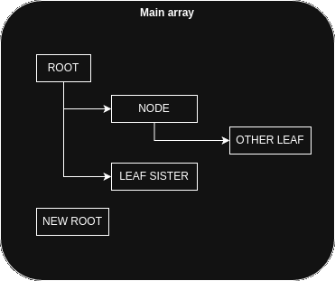

# row-to-tree

<div align="center">


-blue>)

[](https://cesar-lizurey.github.io/row-to-tree/)

<a href="https://www.npmjs.com/package/row-to-tree">
  
</a>

</div>

Converts an array of objects into a tree structure, `backend` or `frontend`, with an optimal linear complexity O(n), taking into account various useful options to manage your data. If you want to test it, go to the [demo](https://cesar-lizurey.github.io/row-to-tree/)!

There is no dependency, all the code is here!

## Why?

When you make a SQL request, you often get an array of rows, each of them being linked to another one in a parent/child relation. And you may want to use this array to display a tree, for example in a [Vuetify component](https://vuetifyjs.com/en/components/treeview).

This module helps you convert the original array into an array of parents and child, building the expected tree:

<div align="center">

</div>

## Example

The test file provides an example of what could be done. Suppose you have the following table:

| id  | id_parent |    name     |
| :-: | :-------: | :---------: |
|  1  |   null    |    ROOT     |
|  2  |     1     |    NODE     |
|  4  |     1     | LEAF SISTER |
|  6  |     2     | OTHER LEAF  |
|  5  |   null    |  NEW ROOT   |

You will end up with an array of objects,

## How?

### Installation

```sh
npm install --save row-to-tree
```

### Usage

```javascript
const { rowToTree } = require("row-to-tree");

const data = [
  { id: 1, id_parent: null, name: "ROOT" },
  { id: 2, id_parent: 1, name: "NODE" },
  { id: 4, id_parent: 1, name: "LEAF SISTER" },
  { id: 6, id_parent: 2, name: "OTHER LEAF" },
  { id: 5, id_parent: null, name: "NEW ROOT" },
];

console.log(rowToTree(data));
```

You will get this nested array:

```javascript
[
  {
    id: 1,
    id_parent: null,
    name: "ROOT",
    children: [
      {
        id: 2,
        id_parent: 1,
        name: "NODE",
        children: [
          {
            id: 6,
            id_parent: 2,
            name: "OTHER LEAF",
            children: [],
          },
        ],
      },
      {
        id: 4,
        id_parent: 1,
        name: "LEAF SISTER",
        children: [],
      },
    ],
  },
  {
    id: 5,
    id_parent: null,
    name: "NEW ROOT",
    children: [],
  },
];
```

### API

`rowToTree(data, options)`

Convert an array of objects into a tree structure: returns an array of root objects.

<table>
  <thead>
    <tr>
      <th colspan="2">
        Key
      </th>
      <th>
        Type
      </th>
      <th>
        Optional
      </th>
      <th>
        Description
      </th>
      <th>
        Default
      </th>
    <tr>
  </thead>
  <tbody>
    <tr>
      <td colspan="2">
        data
      </td>
      <td>
        Array
      </td>
      <td>
        ❌
      </td>
      <td>
        the array of objects to convert
      </td>
      <td>
      </td>
    </tr>
    <tr>
      <td colspan="2">
        options
      </td>
      <td>
        JSON
      </td>
      <td>
        ✅
      </td>
      <td>
        the JSON of customized paramaters
      </td>
      <td>
        {}
      </td>
    </tr>
    <tr>
      <td>
        ├──
      </td>
      <td>
        idKey
      </td>
      <td>
        String
      </td>
      <td>
        ✅
      </td>
      <td>
        the name of the key that identifies an object
      </td>
      <td>
        "id"
      </td>
    </tr>
    <tr>
      <td>
        ├──
      </td>
      <td>
        parentKey
      </td>
      <td>
        String
      </td>
      <td>
        ✅
      </td>
      <td>
        the name of the key that identifies the parent of an object
      </td>
      <td>
        "id_parent"
      </td>
    </tr>
    <tr>
      <td>
        ├──
      </td>
      <td>
        childrenKey
      </td>
      <td>
        String
      </td>
      <td>
        ✅
      </td>
      <td>
        the name of the key that will contain the children of an object
      </td>
      <td>
        "children"
      </td>
    </tr>
    <tr>
      <td>
        └──
      </td>
      <td>
        cleanEmptyChildren
      </td>
      <td>
        Boolean
      </td>
      <td>
        ✅
      </td>
      <td>
        delete the `childrenKey` if the node has no child, i.e. a leaf.
      </td>
      <td>
        false
      </td>
    </tr>
  </tbody>
</table>

## Licence

MIT
